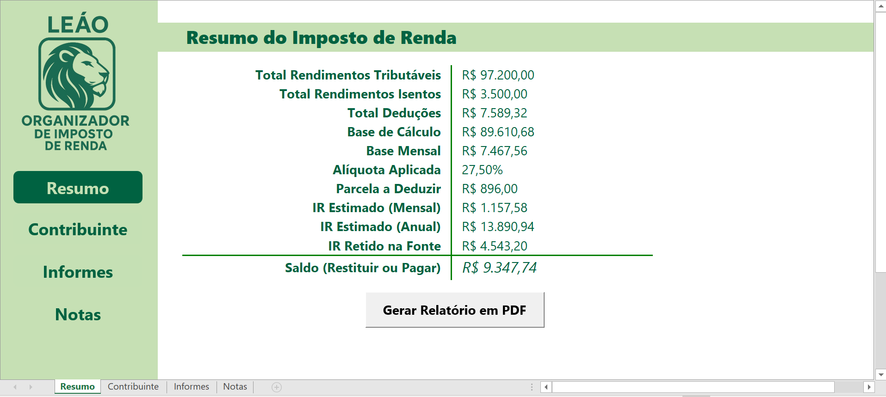

# 📊 Planilha Organizador de Imposto de Renda

Este é um projeto de planilha em estilo aplicativo, desenvolvido no Excel com recursos avançados, para auxiliar na organização e simulação do Imposto de Renda Pessoa Física.

## 📌 Funcionalidades

- **Menu lateral interativo**
- **Preenchimento facilitado por listas suspensas** (ex: banco, tipo de bem, código do rendimento)
- **Padronização de campos** como CPF (`000"."000"."000"-"00`), CNPJ e datas
- **Importação automática de dados** via Power Query (PDF, CSV, etc.)
- **Resumo com Simulação de IR** automático, com cálculo de imposto devido ou a restituir
- **Geração de PDF com todas as abas** via macro em VBA
- **Estilo visual tipo aplicativo**, com design limpo e navegação intuitiva

## 🗂️ Estrutura da Planilha

| Aba            | Finalidade |
|----------------|------------|
| `Contribuinte` | Dados pessoais do declarante e dependentes |
| `Informes`     | Informes de rendimento, saldos bancários e aplicações |
| `Notas`        | Registro de movimentações, rendimentos isentos e tributáveis |
| `Resumo`       | Simulação automática do IR com base nas demais abas |

## ▶️ Como usar

1. **Abra a planilha no Excel**  
   Habilite **macros**, se solicitado.

2. **Preencha as abas na ordem sugerida no menu lateral:**
   - 🔹 **Contribuinte**: Dados do declarante e seus dependentes
   - 🔹 **Informes**: Bancos, saldos, rendimentos, investimentos
   - 🔹 **Notas**: Outras fontes de renda (aluguéis, lucros, rendimentos isentos)

3. **Utilize os recursos inteligentes:**
   - Listas suspensas para tipos de rendimentos, instituições e classificações
   - Máscaras e formatações personalizadas (ex: CPF: `000"."000"."000"-"00`)

4. **Veja o cálculo automático na aba Resumo:**
   - Total de rendimentos tributáveis e isentos
   - Deduções com base nos dependentes e valores inseridos
   - Base de cálculo do IR
   - IR devido ou a restituir, considerando IR retido

5. **Gere um PDF (opcional):**
   - Clique no botão **"Gerar Relatório"** para exportar todas as abas em um único PDF

## 📷 Imagens do Projeto

### 🎨 Visual geral estilo aplicativo:

## ⚙️ Tecnologias e Recursos Utilizados

- Excel Avançado (VBA, Validação de Dados)
- Formatação condicional, máscaras de entrada e validação de preenchimento
- Padronização visual com cores e tipografia consistentes

## 📝 Observações

- Os dados são fictícios e usados apenas para fins ilustrativos.
- A planilha pode ser adaptada para uso real com dados do contribuinte.
- Otimizada para uso anual (ex: declaração ano-base 2024).

## 🛠️ Requisitos

- Microsoft Excel 2016 ou superior (para suportar fórmulas, gráficos e controles)

## 📥 Download

Você pode baixar a planilha completa [clicando aqui](https://github.com/tbrssnn/planilha-organizador-ir/raw/main/files/Projeto-OrganizadorIR-Macro-VersaoFinal.xlsm)

## 🧠 Autor

Thiago Brassanini
tbrassanini@gmail.com

